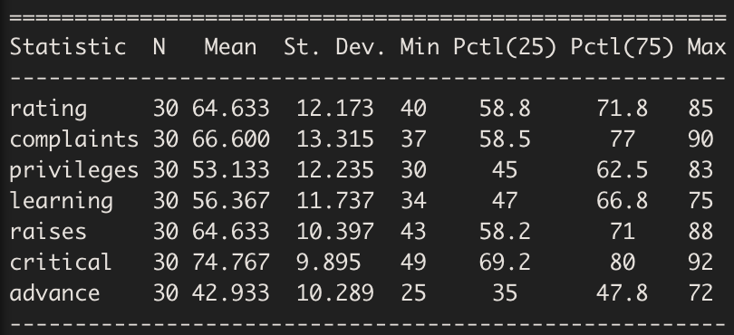
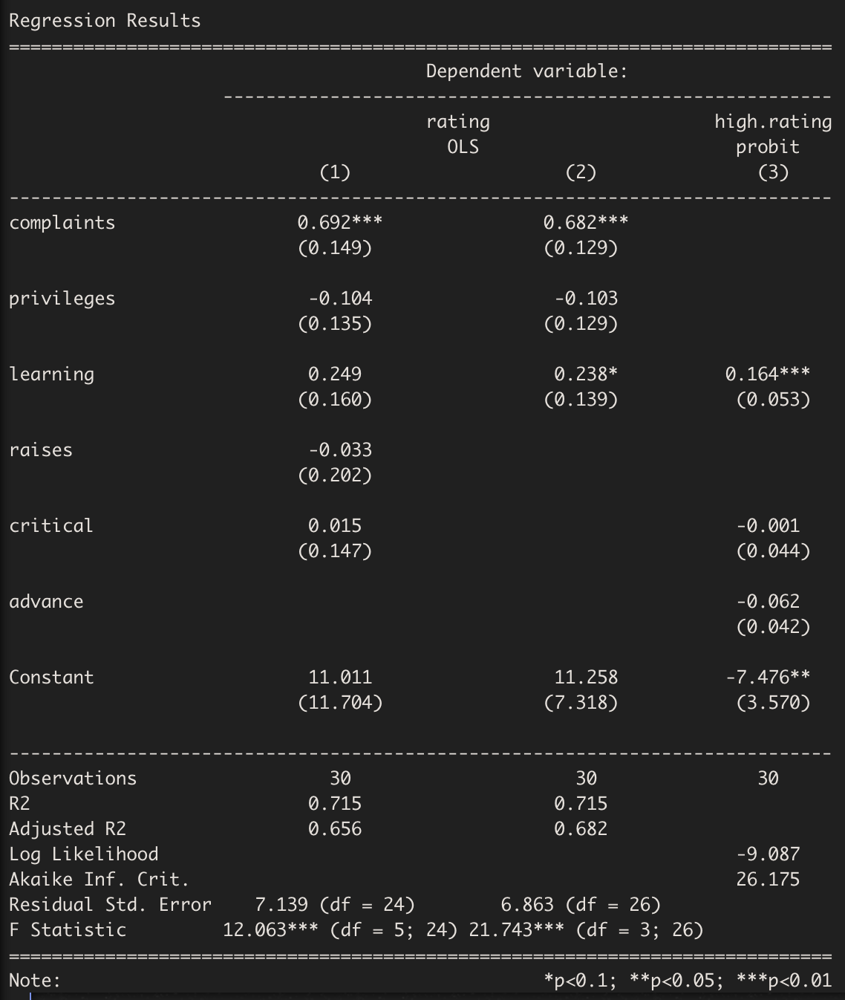
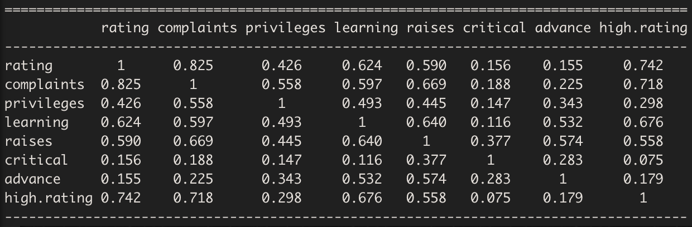

# 在R中输出格式化的回归结果 | stargazer包

在实证分析的过程中，各种回归模型十分常用，特别是参数模型。而且我们常常需要运行多种参数回归模型，并对参数估计值、显著性等统计性质进行比较。此时，如果用copy paste或者手动输入，那么则耗时耗力，且有一定错误率。如果你也有相同烦恼，那么stargazer包可以完美地解决你的烦恼。他可以快速、准确、清晰地输出回归结果。

## 安装

与其它R包的安装方式无异，我们可以通过`install.packages()`和`library()`函数来下载和导入stargazer包。
	
```r
install.packages("stargazer")
library(stargazer)
```

## 描述性统计值

在估计回归模型之前，我们常常也需要对数据的描述性统计性质进行分析，以便了解变量的分布和变量间的联合分布，这对后续的回归模型设定具有重要意义。stargazer包能使我们方便地分析描述性统计值。我们此处以R内自带数据集attitude为例。

```r
stargazer(attitude, type = "text")
```
运行上述程序后，我们就会得到下表。



如果需要输出latex或者html格式，那么指定`type="latex"`或者`type="html"`即可。当然，我们还有其他一些重要的参数。

- `title`: 定义表格的标题
- `out`: 	定义导出文件的路径，文件类型可以是`.tex`, `.txt`, `.htm`或者`.html`。
- `flip`: 默认为FALSE。当定义为TRUE时，则表示转置，即各变量按列排列。
- `digits`: 定义输出数值的小数位数。

## 参数回归模型结果

此处，我们依然使用attitude数据包，以`rating`作为因变量，其他各变量作为协变量，用两个线性模型和一个Probit模型进行参数估计。

```r
##  2 OLS models
linear.1 <- lm(rating ~ complaints + privileges + learning 
                        + raises + critical, data=attitude)

linear.2 <- lm(rating ~ complaints + privileges + learning, data=attitude)

## create an indicator dependent variable, and run a probit model
 
attitude$high.rating <- (attitude$rating > 70)
probit.model <- glm(high.rating ~ learning + critical + advance, data=attitude,
                    family = binomial(link = "probit"))
```

在得到各模型后，我们可以运行以下程序汇总和输出三个模型的结果。

```r
stargazer(linear.1, linear.2, probit.model, type="text", title="Regression Results")
```

汇总和输出结果如下表。



在输出回归结果时，我们也可以定义一些重要的参数。

- `single.row`: 默认值为FALSE。当取值为TRUE，表示将参数和t统计值或其它参数统计值放在一行，而不是分上下放置。
- `ci`: 默认为FALSE。当取值为TRUE时，表示将在参数估计值后报告置信区间，而不是t统计值。
- `ci.level`: 定义置信度水平。
- `omit.stat`: 定义不需要报告的统计值。例如，`omit.stat=c("f"."ser")`，表示不需要报告模型的F统计值和Residual Std. Error，即残差的标准误。
- `keep.stat`: 定义需要报告的统计值。默认是报告所有的协变量。例如，`keep.stat="n"`，表示只需要报告样本量。
- `keep`: 定义需要包含在输出结果中的变量。当模型协变量数目很多，而我们又只关注个别变量的系数时，这个参数则能够起到作用。例如，`keep=c("complaints","learning","raises","critical")`。
- `order`: 定义输出结果中变量的顺序。例如，`order=c("learning", "raises")`。

## 相关系数表

stargazer包还能汇总整理相关系数表。以attitude数据集为例，运行以下程序即可获得相关系数表。

```r
correlation.matrix <- cor(attitude)
stargazer(correlation.matrix, type="text")
```



## 参考文献

Hlavac, Marek (2018). stargazer: Well-Formatted Regression and Summary Statistics Tables. R package version 5.2.2. https://CRAN.R-project.org/package=stargazer

